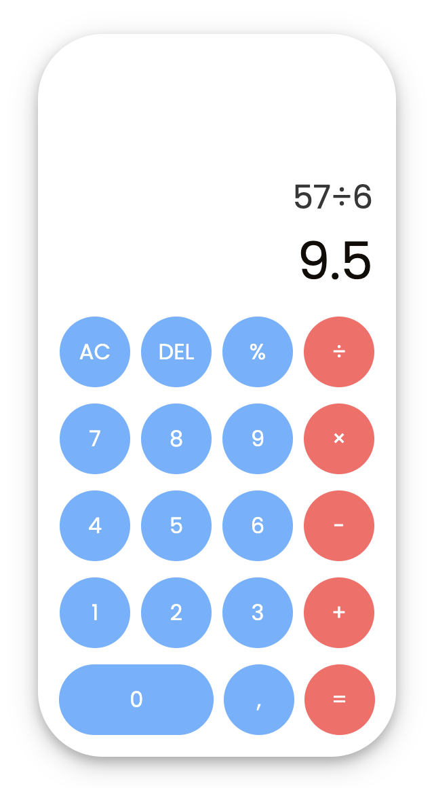

# JavaScript Calculator

This is a simple and functional calculator built using HTML, CSS, and JavaScript. It allows users to perform basic arithmetic operations like addition, subtraction, multiplication, and division. It also supports percentage calculations and decimal input.

## Calculator Design

Below is a visual representation of the calculator's design:

